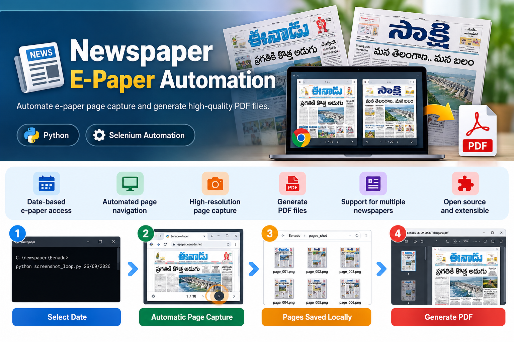

# Newspaper E-Paper Automation

<p align="center">
  
</p>

<p align="center">
  <strong>Automate e-paper page capture and generate high-quality PDF documents.</strong>
</p>

<p align="center">
  <a href="#features">Features</a> •
  <a href="#supported-newspapers">Supported Newspapers</a> •
  <a href="#technology-stack">Technology Stack</a> •
  <a href="#installation">Installation</a> •
  <a href="#usage">Usage</a> •
  <a href="#project-structure">Project Structure</a> •
  <a href="#contributing">Contributing</a> •
  <a href="#roadmap">Roadmap</a>
</p>

<p align="center">


</p>

---

## Overview

**Newspaper E-Paper Automation** is an open-source Python project designed to automate the process of accessing newspaper e-paper pages, capturing individual pages, and generating high-quality PDF documents.

The project provides separate automation implementations for different newspapers.

Each newspaper integration is maintained independently because different e-paper platforms may use different:

- Page layouts
- Navigation systems
- HTML structures
- Image loading mechanisms
- Browser behavior
- Authentication systems
- Page detection methods

This modular approach makes it easier to maintain existing integrations and add support for new newspapers without unnecessarily affecting other integrations.

---

# Supported Newspapers

## Currently Available

| Newspaper | Status |
|-----------|--------|
| **Eenadu** | ✅ Available |
| **Sakshi** | ✅ Available |

## Coming Soon

More newspaper integrations will be added in future releases.

Potential and planned integrations include:

- **Andhra Jyothi**
- **Namasthe Telangana**
- Additional regional newspapers
- Additional newspaper editions
- More language support
- Improved cross-platform support

> **Note:** Each newspaper is implemented separately because e-paper websites can differ significantly in their page structure, navigation, authentication, and image delivery systems.

---

# Features

- 📅 Date-based e-paper access
- 🌐 Browser-based automation
- 🔄 Automated page navigation
- 📸 High-resolution page screenshots
- 📄 High-quality PDF generation
- 🧩 Independent newspaper integrations
- 🛠️ Modular project architecture
- 💻 Command-line execution
- 🌍 Designed for multiple newspapers
- 🌐 Future multi-language support
- 🔓 Open-source MIT License
- 🤝 Developer-friendly architecture
- 👨‍💻 Open to developer contributions

---

# Technology Stack

The project currently uses the following technologies:

| Technology | Purpose |
|------------|---------|
| **Python** | Core automation |
| **Selenium** | Browser automation |
| **Undetected ChromeDriver** | Chrome automation |
| **Pillow** | Image processing and PDF generation |
| **Google Chrome** | E-paper browser automation |

---

# Requirements

Before using the project, make sure you have:

- Python **3.10 or later**
- Google Chrome
- Internet connection

Check your Python version:

```bash
python --version
